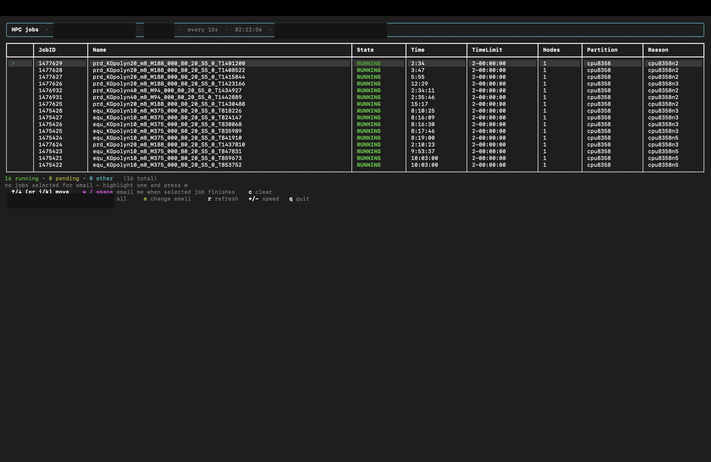
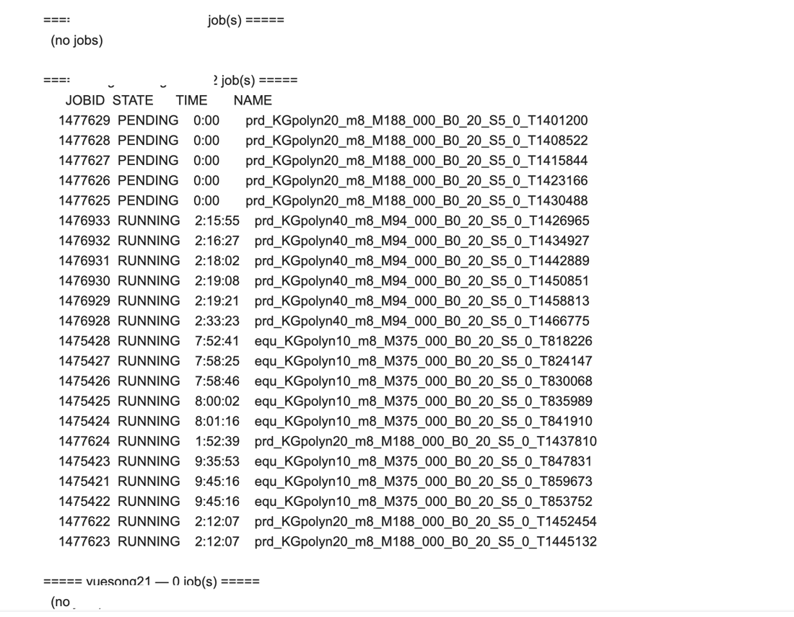

# HPC_mentor

A live SLURM job monitor for the terminal, so you don't have to run
`squeue -u <name>` over and over by hand.

It runs locally and SSHes into the cluster over a single multiplexed connection
(you authenticate once, then every refresh reuses the same socket). Job queries
use `squeue -u <user>`, so you can watch any account you have permission to see
and switch between them with a keypress. You can also "watch" a specific job and
get an email on every status change (and when it finishes), or drive it entirely
by email.

## Screenshots

Live monitor:



Email-bot reply — all jobs grouped by user:



## Install

```bash
git clone https://github.com/Yuxiang-Chem/HPC_mentor.git
cd HPC_mentor
python3 -m venv .venv
.venv/bin/pip install -r requirements.txt
```

## Configure your cluster (do this first)

Create `~/.config/hpc_mentor/cluster.json` with your SSH host, your login user,
and the accounts to watch. Each account has a press-key, a label, and the
usernames to query with `squeue -u`:

```json
{
  "ssh_host": "login.your-hpc.example.edu",
  "ssh_user": "myusername",
  "accounts": [
    {"key": "1", "label": "Me",      "users": ["myusername"]},
    {"key": "2", "label": "Labmate", "users": ["labmate"]}
  ]
}
```

- `ssh_user` is the name you log in *as* (the tool connects as `ssh_user@ssh_host`).
  Leave it empty only if you already have a matching `Host` entry in
  `~/.ssh/config` that sets the user.
- An "all" view (key `a`) that combines every account is added automatically. If
  this file is missing, the tool falls back to generic placeholders.

## Passwordless login (recommended)

The monitor authenticates **once** at startup and reuses that connection for
every refresh. That first login can use either a password or an SSH key:

- **Password:** just run `./jobs` — it prompts for your cluster password once,
  then opens the live view. (You'll re-enter it each time you start the tool.)
- **SSH key (no password ever):** run the one-time setup below.

```bash
./set-ssh
```

It records your login username, creates an SSH key if you don't have one,
installs your public key on the cluster (you type your password one last time),
and verifies that login no longer asks for a password. After that, `./jobs`
connects instantly.

The **first time** you run `./jobs` without passwordless login set up, it offers
to run this for you. Decline and it won't ask again (password login keeps
working); run `./set-ssh` yourself whenever you want.

## Run

```bash
./jobs            # start on the first account
./jobs all        # combined view of all accounts
./jobs 2          # start on account "2"
```

A self-contained virtualenv in `.venv` is used automatically by `./jobs`.

### `hpcjobs` shortcut

Add this to `~/.zshrc` (use the path where you cloned the repo), then open a new
terminal:

```bash
alias hpcjobs='/path/to/HPC_mentor/jobs'
```

## Keys

| Key | Action |
|-----|--------|
| `j` / `k` | move the cursor down / up to highlight a job |
| `w` / `space` | watch the highlighted job — email me on every status change |
| `c` | clear all watched jobs |
| `e` | change the notification email address (type it, Enter) |
| `1` … | switch to that account (from your `cluster.json`) |
| `a` | all accounts (adds a User column) |
| `r` | refresh now |
| `+` / `-` | change refresh interval (5–120s) |
| `q` | quit |

Default refresh is every 15s. The cursor row is shown with a **green band**;
a **red band** marks a job you're watching (it stays red as you scroll past).
Other rows are colored by state (green = running, yellow = pending,
cyan = completing, red = failed). If the SSH connection drops, an error panel is
shown and the tool keeps retrying.

## Email notifications setup

Watch a job (`w`) and you get an email on **every status change** — e.g.
PENDING → RUNNING — and a final email when it leaves the queue, with the result
(COMPLETED / FAILED / CANCELLED / …) looked up via `sacct`.

```bash
./set-email
```

It asks for the sending address (it auto-detects the SMTP server for QQ, 163/126,
Gmail, Outlook, iCloud, Yahoo), where to send alerts, and the password /
authorization code (hidden). For **QQ Mail** use an *authorization code* (授权码)
from 设置 → 账号 → 开启 SMTP — not your login password.

This writes `~/.config/hpc_mentor/config.json` (perms `600`):

```json
{
  "smtp_host": "smtp.qq.com",
  "smtp_port": 465,
  "smtp_user": "you@qq.com",
  "smtp_pass": "your-authorization-code",
  "recipient": "where-to-notify@example.com"
}
```

Port 465 uses SSL; 587 uses STARTTLS — both are handled automatically. You can
also leave `smtp_pass` empty and export `HPC_MENTOR_SMTP_PASS` instead.

The header shows `email on -> …` when configured, or `email off …` otherwise.
If email is off, watched jobs still show a finish message in the UI.

## Email bot — check jobs by email (read-only)

Email a secret keyword to a mailbox and the bot replies with **all jobs, grouped
by user**. Useful when you're away from your terminal.

```bash
./set-bot     # one-time: bot mailbox, allowed senders, secret keyword
./hpc-bot     # run it (keep the window open; machine awake + on VPN)
```

**To use it:** send an email to the bot mailbox with your **secret keyword**
anywhere in the subject or body. The reply lists every account's jobs in
per-user sections.

**Safety model (read-only by design):**
- A message is acted on **only if** the `From:` address is in your allowed list
  **and** the secret keyword is present. Anything else is ignored silently.
- The keyword is the real gate — `From:` headers can be spoofed.
- The bot only ever runs `squeue` (read-only). There is **no** path to arbitrary
  shell, job submission, or cancellation.
- It runs on your machine, so it only answers while that machine is awake, on
  VPN, and `./hpc-bot` is running.

Activity is logged to `~/.config/hpc_mentor/bot.log`. Config:
`~/.config/hpc_mentor/bot.json` (perms `600`).

## Config files

All personal settings live under `~/.config/hpc_mentor/` (never in the repo):

| File | What |
|------|------|
| `cluster.json` | SSH host + login user + accounts (usernames) |
| `config.json` | email-on-finish SMTP settings |
| `bot.json` | email-bot mailbox, allowed senders, keyword |
